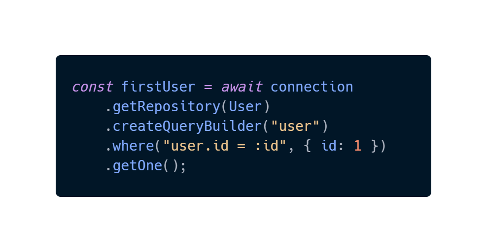

<div align="center">

  ## 📓

  # **To do REST API**
  
</div>

<div>
    
</div>

<br>

<div align="center">

Api REST **mvc** em [NestJS](https://nestjs.com/) para a fazeres

</div>

## Tecnologias

- Typescript
- NestJS
- Prettier
- TypeORM
- SQL
- Postman

## Instalacao

Para instalar todas as dependencias do projeto, execute o comando:

```
$ npm install
```

## Iniciando API

Para iniciar sua api execute o seguinte comando:

```
$ npm run start
```

Logo depois a aplicação estará rodando em seu **localhost:3000**

## Features

- CRUD de to do's para um usário e para um adminstrador
- Autenticação e autorização de endpoints com jwt [veja mais](https://docs.nestjs.com/security/authentication)
- Uso do typeORM como relational object da aplicação
- Uso do sqlite para migrar e obter os dados

## Por que usar o NestJS?

O NestJs atende um desenvolvimento rápido e com dev hacks muito ágeis através do seu [CLI](https://docs.nestjs.com/cli/overview) e toda sua estrutura. Além disso, sua flexibilidade que possibilita o uso do [express](https://expressjs.com/pt-br/) e a integração com vários bancos de dados de maneira rápida e eficaz é uma vantagem.

### Nest TypeORM
---
Possibilita realizar queries poderosas para os bancos de dados



### NestJS auth
---
Com recursos de jwt e [strategies](https://docs.nestjs.com/microservices/custom-transport#creating-a-strategy) do Nest, é possível realizar a autenticação de maneira segura e eficaz [veja mais](https://docs.nestjs.com/security/authentication)

### Nest CLI
---
Sua CLI agiliza e torna sua arquitetura e desenvolvimento flexível e dinâmico, neste caso foi usada a mvc.